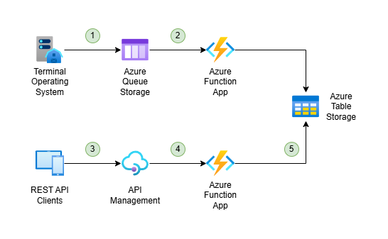
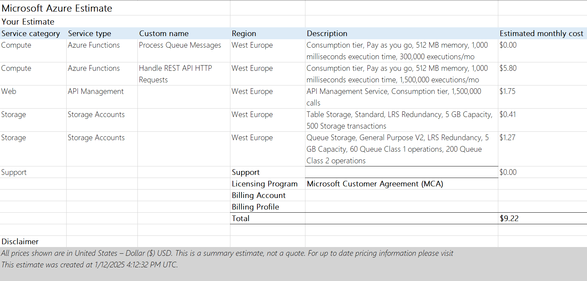
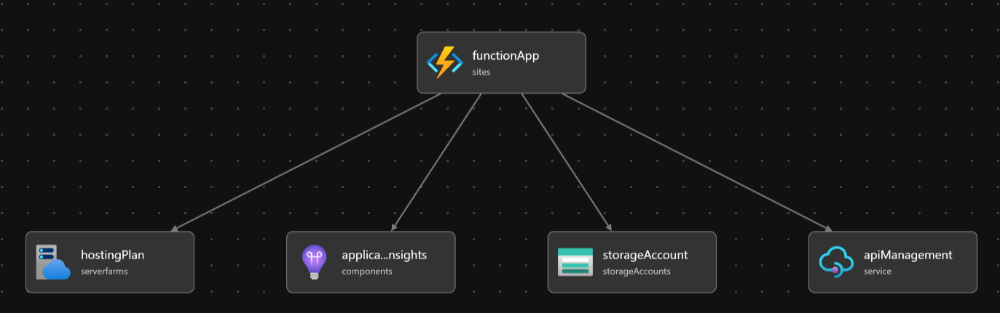
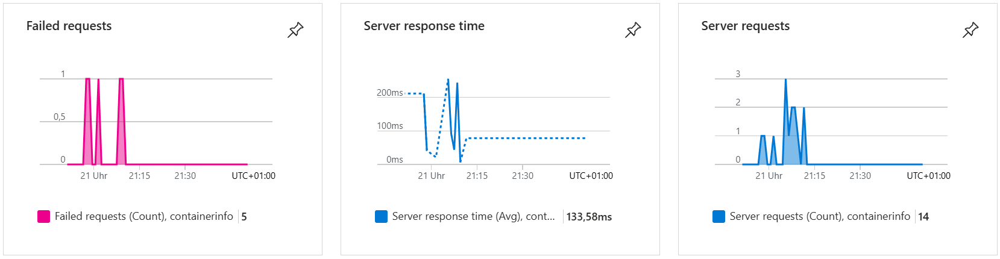

# azure-sample-container-info

Example architecture of a logistics web application in the Microsoft Azure cloud.

## Goal

Building a REST API that provides information about the current status of containers, such as their ISO code, or whether
they've arrived or departed.

## Architecture

This goal is achieved as follows:

1. When the status of a container is updated at the facility, the terminal operating system sends a message to Azure Queue Storage.
2. The new message triggers an Azure Function which consumes the message and stores the new container status in Azure Table Storage.
3. Clients (such as container operators) can access a REST API that is published via Azure API Management.
4. Azure API Management calls an Azure Function.
5. The Azure Function retrieves and returns the container status from Azure Table Storage.

## Characteristics

`azure-sample-container-info` is deployed to Microsoft Azure, which is a _public cloud_: There's no upfront costs for
providing the infrastructure for deploying the application. The application can be quickly provisioned and
deprovisioned if necessary, and the owning organization pays only for what they use.

It's entirely based on _Platform as a Service_: The cloud provider maintains the physical infrastructure,
physical security, and connection to the internet. They also maintain the operating systems, middleware,
development tools, and business intelligence services that make up the cloud solution. In turn, the owning organization
is responsible for the data stored in the cloud, and who can access it, and how (_shared responsibility_).

## Benefits

* **High availability**: The application is available when needed.
* **Scalability**: Compute and storage resources are automatically adjusted to meet demand.
* **Reliability**: The application recovers from failures and continues to function.
* **Security**: The cloud provider takes care of patches and maintenance, and is well suited to handle things like DDoS attacks.
* **Manageability**: Resources can be deployed based on preconfigured templates, and the organization is aware of performance in real time due to automatic alerts based on configured metrics.

## Management Infrastructure

While you can develop the application locally (by running the Azure Functions locally and storing data in
[Azurite](https://learn.microsoft.com/en-us/azure/storage/common/storage-use-azurite?tabs=visual-studio%2Ctable-storage)),
we recommend setting up two different subscriptions:

* Staging
* Production

Usually, Azure Functions allow you to use
[deployment slots](https://learn.microsoft.com/en-us/azure/azure-functions/functions-deployment-slots?tabs=azure-portal)
for staging your application. However, this forces you to put your staging environment in the same subscription as your
production environment, which violates recommended billing and access control boundaries. You can still use deployment
slots for prewarming before going live with a new version of your application, as well as easy fallbacks in case of 
live issues.

## Physical infrastructure

The application does not require any zone redundancy for the function app or storage:

* Accessing the data is not mission-critical for the organization - containers can still be accepted at and delivered
from a facility, even if the container info API is unavailable.
* The data can easily be restored from its source if necessary.

Storage is still relying on _locally redundant storage (LRS)_, which replicates the data three times within a single
data center, providing at least 11 nines of durability (99.999999999%) of objects over a given year. It protects the
data against unexpected server rack and drive failures, and is still the lowest-cost redundancy option.

## Compute Services

The application compute service is based on _Azure Functions_, which allows us to not worry about the underlying
platform or infrastructure. They're automatically invoked when new data is available at the input queue, or an HTTP 
request is made to access the data. Azure Functions allows the application to scale automatically based on demand,
which can vary as global supply chains have proven to be unpredictable in the recent past. 

## Identity, Access & Security

The Function App itself is protected by an API Management service instance, and not publicly accessible. API Management
in turn provides simple, but weak protection in form of
[API keys](https://learn.microsoft.com/en-us/azure/api-management/api-management-subscriptions), as well as stronger
options such as [securing the API through Microsoft Entra ID](https://learn.microsoft.com/en-us/azure/api-management/api-management-howto-protect-backend-with-aad).

## Cost Management

For estimating the monthly costs of the application, we're considering the following assumptions:

* 10,000 container status updates per day (300,000 per month)
* 50,000 container info requests per day (1,500,000 per month)
* 20,000 containers to store data about, 10 kB per container (200 MB storage)

Even when generously rounding up

* storage capacity from 200 MB to 5 GB
* storage transactions from 1,800,000 to 5,000,000 (= 500 transaction units)
* enqueue operations from 300,000 to 600,000 (billed in 10,000s)
* dequeue operations from 300,000 to 2,000,000 (billed in 10,000s) to account for retries, etc.

we can use the official [Azure Pricing Calculator](https://azure.microsoft.com/en-us/pricing/calculator) to end up with
a cost estimate of less than 10 $/month:

If we're constantly observing significantly higher loads, we can reserve capacity for Azure Functions to further reduce
these costs.

## Deployment

We can use [Bicep](AzureSampleContainerInfo.bicep) to deploy the application, which allows for repeatable results across
staging and production environments, orchestration of the deployment of related resources, and is more concise and
easier to read than most alternatives.

The Bicep file automatically applies the following tags of the resource group to all created resources for convenience:

* _AppName_: Name of the application that the resource is part of (e.g. "azure-sample-container-info").
* _CostCenter_: Internal cost center code (e.g. "T1").
* _Owner_: Name of the business owner who's responsible for the resource (e.g. "Nick Prühs").
* _Environment_: Environment name (e.g. "Development", "Test", "Production").
* _Impact_: How important the resource is to business operations (e.g. "Low", "High", "Critical").

Then, we can use [GitHub Actions](.github/workflows/windows-dotnet-functionapp-on-azure.yml) to automatically deploy
any code changes to our staging environment.

## Monitoring

We recommend [sending function app logs to Azure Log Analytics](https://learn.microsoft.com/en-us/azure/azure-functions/monitor-functions?tabs=portal#azure-monitor-resource-logs) for diagnosing development and live issues. Note that
[it can take up to 90 minutes](https://learn.microsoft.com/en-us/azure/azure-monitor/essentials/diagnostic-settings#time-before-telemetry-gets-to-destination)
for your first logs to arrive.

We're also deploying an Application Insights instance to be able to monitor important metrics such as request counts,
response times or failure rates.

Finally, we recommend setting up the following types of alerts to get notified of any unusual and potentially undesired
behavior, and ensure security and reliability for your application:

* [Azure Monitor alerts](https://learn.microsoft.com/en-us/azure/azure-functions/monitor-functions?tabs=portal#alerts) (e.g. for unusually high request counts)
* Security alerts in Microsoft Defender for Cloud for your subscription
* Azure Service Health alerts for your subscription
